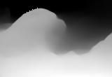
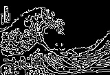
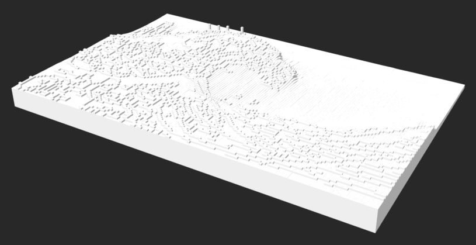

# The Great Wave off Kanagawa

## Step 1 - Find the source image

## Step 2 - Get a depth map of the image

Use `DepthMap.py` to generate the depth map.

## Step 3 - Get the edges of the original image

Use the `Canny` or `Sobel` function in `EdgeDetection.py` to get the edges of the images.

## Get the weighted merge of the two images

This step is not a separate step and is included in `ToSTL_memrged.py`. However, if you just want to see just the image form of this data, you can use `ToJPG_merged.py`.

## Convert it to an STL with height proportional to the intensity of the corresponding pixel

Use `ToSTL_memrged.py` to get convert the depth map and edge data into a 3D model.

## 3D Print your model

Use your favorite 3D printer to print your model.
