# Converting Monocular Images to 3D Models

## Step 1 - Find an Image

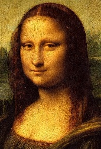

## Step 2 - Get a depth map of the image

Use `DepthMap.py` to generate the depth map.

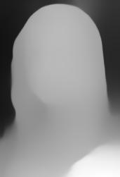

## Step 3 - Get the edges of the original image

Use the `Canny` or `Sobel` function in `EdgeDetection.py` to get the edges of the images.

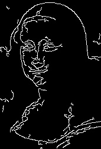

## Get the weighted merge of the two images

This step is not a separate step and is included in `ToSTL_memrged.py`. However, if you just want to see just the image form of this data, you can use `ToJPG_merged.py`.

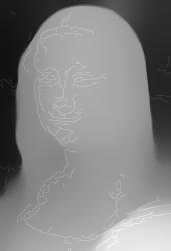

## Convert it to an STL with height proportional to the intensity of the corresponding pixel

Use `ToSTL_memrged.py` to get convert the depth map and edge data into a 3D model.

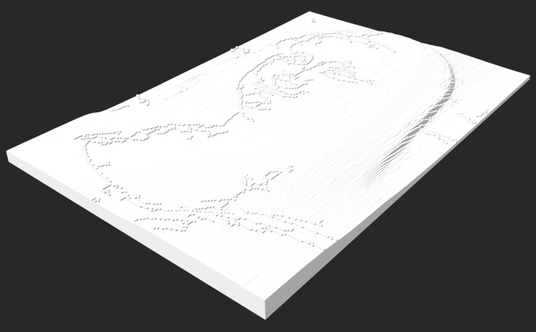

## 3D Print your model

Use your favorite 3D printer to print your model.

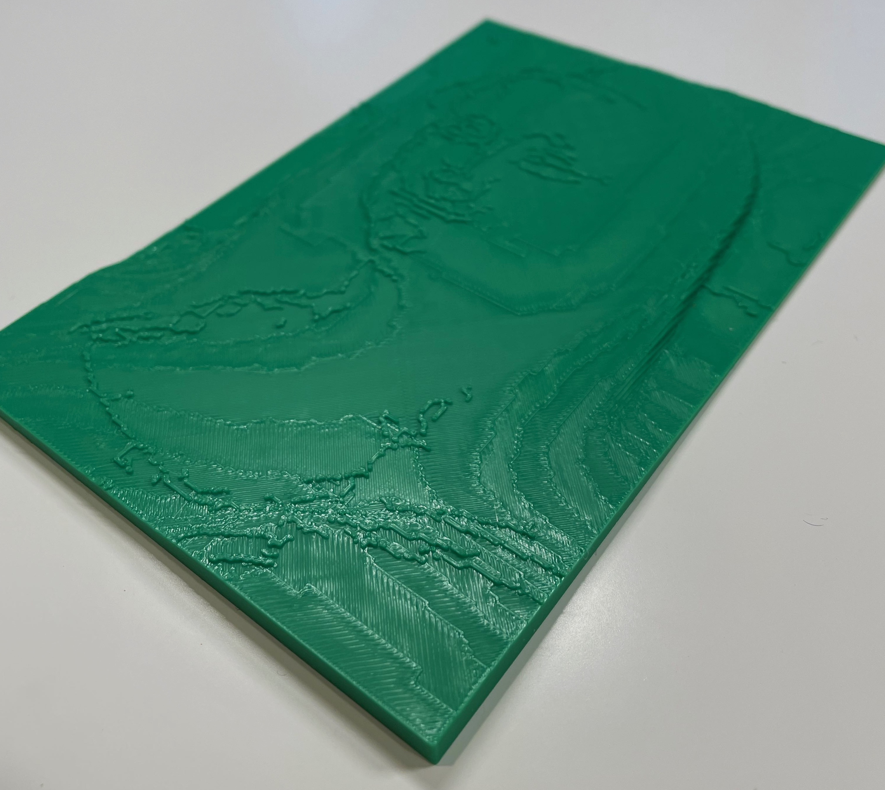

# Other examples

## [The Great Wave of Kanagawa](Docs/Great_Wave/README.md)

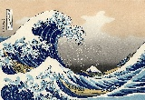   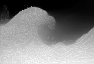

Image caption: `the great wave off kanagawa`

## [Starry Night](Docs/Starry_Night/)

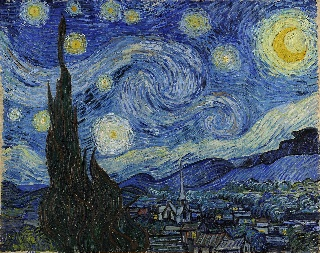   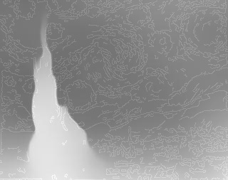

Image caption: `the starry night by van gogh`

## [Starry Night Simple](Docs/Starry_Night_Simple/)

   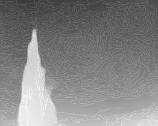

Image caption: `the starry night by van gogh`

## [Starry Night Simplest](Docs/Starry_Night_Simplest/)

   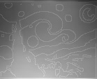

Image caption: `the art of the simpsons`
